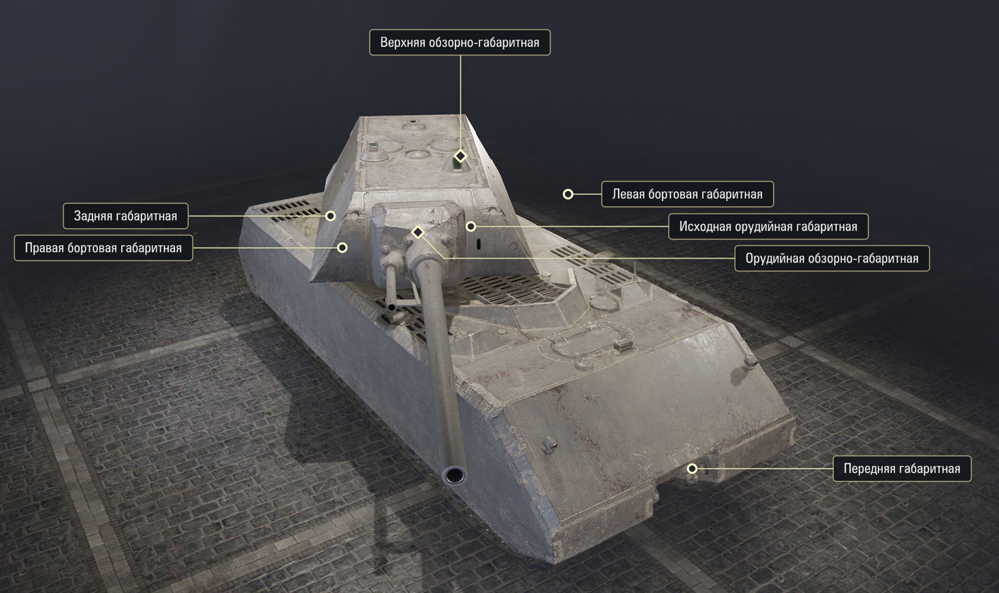
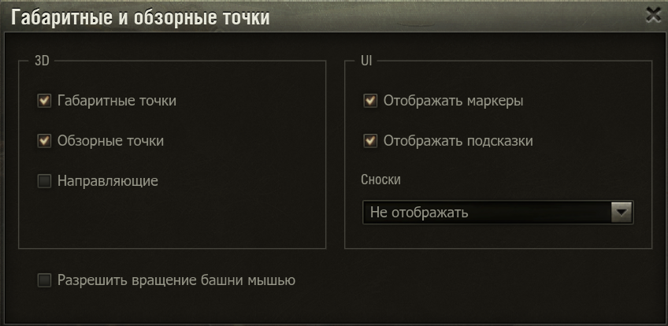

### | RU | [EN](./README_EN.md) |

# Spotting Points

Мод для Мира Танков и World Of Tanks который отображает в ангаре обзорные и габаритные точки танков. 

## Установка
1. Скачайте файл мода [`wotstat.spotting-points_1.0.0`](https://github.com/wotstat/wotstat-spotting-points/releases/latest).
2. Поместите его в папку `Tanki/mods/{АКТУАЛЬНАЯ_ВЕРСИЯ_ИГРЫ}/`.

## Использование

- Через меню модов в ангаре включите мод
- Поставьте галочку напротив нужного варианта
- В режиме маркеров вы можете навести курсор на точку или на сноску и  в подсказке прочесть как она образуется. Так же на танке будут отображаться направляющие линии для этой точки.
- Включите `разрешить вразение башни мышью` чтобы вращать башню и пушку перетаскиванием мыши по ним.

## Возможности
Мод отображает 6 габаритных точек и 2 обзорно-габаритные точки.

### Габаритные точки
1. `Передняя точка` – ровно по центру передней грани описанного вокруг корпуса прямоугольного параллелепипеда.
2. `Задняя точка` – ровно по центру задней грани описанного вокруг корпуса прямоугольного параллелепипеда.
3. `Левая точка` – по центру левой грани описанного вокруг корпуса прямоугольного параллелепипеда **поднятая на высоту** крепления орудия к башне.
4. `Правая точка` – по центру правой грани описанного вокруг корпуса прямоугольного параллелепипеда **поднятая на высоту** крепления орудия к башне.
5. `Исходная орудийная` – в месте крепления орудия к башне (ось качания орудия). При вращении башни остается на месте.

### Обзорно-габаритные точки
1. `Динамическая орудийная` – в месте крепления орудия к башне (ось качания орудия). Вращается вместе с башней.
2. `Верхняя точка` – в референсной точки танка (pivot point, не всегда совпадает с центром танка) поднятая на максимальную высоту башни или корпуса в зависимости от того, что выше.

> Башней танка является та часть, которая вращается вокруг вертикальной оси. Если танк с "качающейся" башней, то считается именно вращающееся крепление этой башни к корпусу (качательный механизм). То что качается вверх-вниз это уже не башня, а орудие.
> Посмотреть что является башней можно в режиме покраски танка.
> 
> Исключение `ELC EVEN 90`, на ней "баг" исправлен и верхяя точка находится над пушкой, а не над башней.