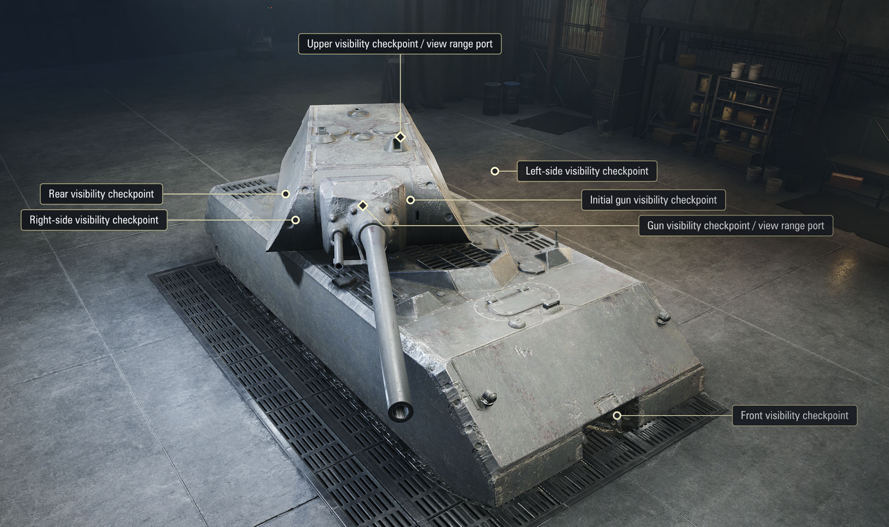
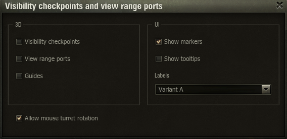
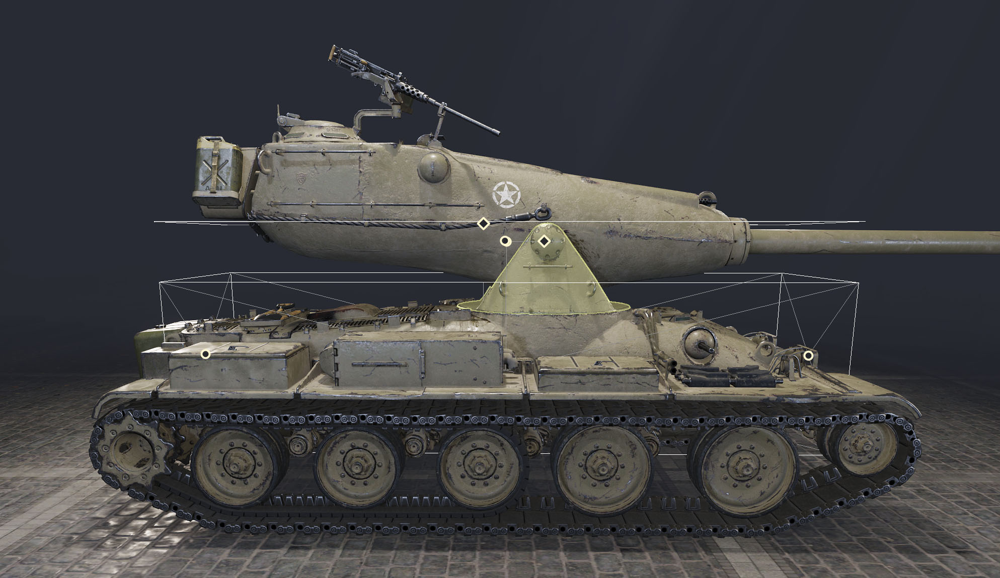

### | [RU](./README.md) | EN |

# Spotting Points

A mod for Мир Танков and World of Tanks that displays tank visibility checkpoints and view range ports in the Garage.

## Installation

1. Download the [`wotstat.spotting-points_1.0.0`](https://github.com/wotstat/wotstat-spotting-points/releases/latest) mod file.
2. Place it in `WOT/mods/{CURRENT_GAME_VERSION}/`.

## Usage

- Enable the mod through the Mods menu in the Garage.
- Select the checkbox next to the option you want to use.
- In marker mode, hover over a point or its label to learn how the point is calculated. Guide lines for that point will also be displayed on the tank.
- Enable `Allow mouse turret rotation` to rotate the turret and gun by dragging them with the mouse.

## Features

The mod displays six visibility checkpoints and two dual-purpose visibility checkpoints / view range ports.

### Visibility checkpoints

1. `Front visibility checkpoint` — at the exact center of the front face of the hull's bounding box.
2. `Rear visibility checkpoint` — at the exact center of the rear face of the hull's bounding box.
3. `Left-side visibility checkpoint` — halfway along the left face of the hull's bounding box, **raised to the height** of the gun mount on the turret.
4. `Right-side visibility checkpoint` — halfway along the right face of the hull's bounding box, **raised to the height** of the gun mount on the turret.
5. `Initial gun visibility checkpoint` — at the gun mount on the turret (the axis around which the gun elevates and depresses). This point stays in place as the turret turns.

### Visibility checkpoints / view range ports

1. `Gun visibility checkpoint / view range port` — at the gun mount on the turret (the axis around which the gun elevates and depresses). This point follows the turret as it turns.
2. `Upper visibility checkpoint / view range port` — above the vehicle's reference point (pivot point, which does not always coincide with the center of the vehicle), at the maximum height of either the turret or the hull, whichever is higher.

> The turret is the part of the tank that rotates around the vertical axis. On a tank with an oscillating turret, only the rotating mount that connects the turret to the hull (the oscillating mechanism) is considered the turret. The part that moves up and down is considered the gun, not the turret.
>
> You can see which part is considered the turret in the vehicle customization mode.
>
> 
